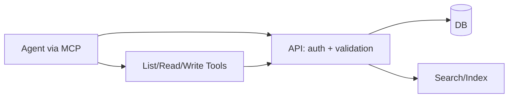

# 1PLAN API + MCP

📄 Product Requirements Document (PRD)

- Purpose: a database-backed API with an MCP (Model Context Protocol) gateway so agents can reliably create, read, update, and organize project knowledge (PRDs, tech plans, features, sprints) via safe, typed endpoints.
- Version: 1.0
- Date: Aug 20, 2025
- Status: Draft — Foundation

## Table of Contents
- [1. Overview](#1-overview)
  - [1.1 Purpose](#11-purpose)
  - [1.2 Background & Problem Statement](#12-background--problem-statement)
  - [1.3 Goals & Objectives](#13-goals--objectives)
  - [1.4 Target Audience](#14-target-audience)
- [2. Key Features & Scope](#2-key-features--scope)
  - [2.1 Core Features](#21-core-features)
  - [2.2 Optional / Nice-to-Have Features](#22-optional--nice-to-have-features)
  - [2.3 Out of Scope](#23-out-of-scope)
- [3. User Stories & Flows](#3-user-stories--flows)
- [4. Example Agent Interactions](#4-example-agent-interactions)
- [5. Functional Requirements](#5-functional-requirements)
- [6. Non-Functional Requirements](#6-non-functional-requirements)
- [7. API & MCP UX Requirements](#7-api--mcp-ux-requirements)
- [8. Technical Requirements](#8-technical-requirements)
- [9. Success Metrics (KPIs)](#9-success-metrics-kpis)
- [10. Timeline & Milestones](#10-timeline--milestones)
- [11. Risks & Assumptions](#11-risks--assumptions)
- [12. Positioning & Prior Art](#12-positioning--prior-art)
- [13. Test Plan](#13-test-plan)

## 1. Overview

### 1.1 Purpose
Provide a robust knowledge backend with a clean API surface and a thin MCP gateway so agents can manage planning artifacts (PRDs, technical overviews, features, sprints) with data integrity, observability, and strong guardrails.

### 1.2 Background & Problem Statement
Ad‑hoc file edits lack consistency, history, and validation. Agents need reliable CRUD, search, and relationships (e.g., features ↔ sprints) with clear contracts. A database and API create a repeatable foundation; an MCP gateway lets any capable agent interact safely.

### 1.3 Goals & Objectives
- Fast, typed API for documents, features, sprints, and projects
- Safe agent access via MCP tools (stateless, token-auth to API)
- Strong foundation: validation, migrations, tests, metrics, logs
- Clear docs, examples, and E2E smoke for agent flows

### 1.4 Target Audience
- Builders using AI agents in IDEs/editors
- Teams wanting a shared knowledge backend with automation hooks

## 2. Key Features & Scope

### MVP Focus Decisions
- Database-backed API with Prisma (SQLite dev, Postgres prod)
- Fastify API with zod validation and OpenAPI
- MCP server (TypeScript) over stdio delegating to API via service token
- Core entities: Project, Document, Feature, Sprint, SprintItem
- Idempotent create/update with requestId; pagination + search
- Observability: requestId propagation, structured logs, p95 latency metrics
- CI: typecheck, lint, unit/integration/E2E smoke

### 2.1 Core Features
- CRUD for documents (PRD, tech overview, sprint overview, sprint page, freeform)
- CRUD for features with simple CSV import/export
- CRUD for sprints and checklist items
- List/search with filters and cursor pagination
- MCP tools that map to API operations

### 2.2 Optional / Nice-to-Have Features
- Full‑text search (SQLite FTS5 / Postgres tsvector)
- Templates and scaffolding generators
- Web UI (read-only) and admin console
- Role-based access control (later)

### 2.3 Out of Scope
- Multi-tenant orgs and payments (future)
- Heavy AI analysis jobs (later)

## 3. User Stories & Flows
- As an agent, I can create a new project with initial docs.
- As a user, I can list recent documents and open the latest PRD.
- As an agent, I can update the sprint checklist and mark items done.
- As a user, I can import/export features as CSV.

User flow (MCP): create project → bootstrap docs → list documents → edit → link features → create sprint.

## 4. Example Agent Interactions
- create_document: { projectId, kind: "prd", title, content }
- list_documents: { projectId, kind: "sprint" }
- update_document: { id, content }
- create_sprint: { projectId, code: "SPR-001", name, status }
- add_sprint_item: { sprintId, text }

## 5. Functional Requirements
- Strict validation on all inputs; return typed errors
- Idempotency for create/update via `X-Idempotency-Key`
- Cursor pagination for list endpoints
- Search by title/content (simple LIKE; FTS optional)
- Consistent slugs and unique codes (feature_id, sprint code)

## 6. Non-Functional Requirements
- Performance: p95 API latency < 150ms local dev, < 250ms prod
- Availability: 99.9% for API in business hours targets
- Reliability: migrations versioned; zero‑data‑loss policy for prod
- Security: token auth; rate limit; payload caps; CORS policy
- Privacy: no PII by default; redact secrets in logs
- Observability: requestId + structured logs + counters/timers
- Accessibility: API docs (OpenAPI) with human examples

## 7. API & MCP UX Requirements
- Consistent resource naming, error shapes, and pagination
- MCP tools mirror API tasks with minimal params
- Helpful error messages, including 429 with Retry‑After

## 8. Technical Requirements
- Language: TypeScript (strict)
- API: Fastify + zod + Prisma
- DB: SQLite (dev), Postgres (prod)
- MCP: @modelcontextprotocol/sdk (stdio)
- Testing: Vitest (unit), Supertest (API), k6 (load), Playwright or simple CLI smoke for MCP
- CI: GitHub Actions (typecheck, lint, tests)
- Packaging: Docker for API; MCP runs as a local stdio command

## 9. Success Metrics (KPIs)
- Week 1: bootstrap_docs tool creates initial docs; API E2E happy path green
- Latency: p95 listDocs < 150ms (dev), < 250ms (prod)
- Reliability: 100% migration success in CI
- DX: setup < 5 minutes; one‑command E2E smoke

## 10. Timeline & Milestones
- 48h MVP: API + DB schema, core CRUD, MCP gateway, bootstrap seed
- Alpha: CSV import/export for features; sprint checklist; OpenAPI and examples
- Beta: search, indexing; dashboards for latency/errors; backup/restore

See Sprint plan: [SPR-001 — Foundation & API + MCP](../ops/sprints/SPR-001.md)

## 11. Risks & Assumptions
- Risk: schema churn → Mitigation: migrations + seed versioning
- Risk: token leakage → Mitigation: minimal scopes, rotation, secrets hygiene
- Assumption: single-user/single-project initially

## 12. Positioning & Prior Art
- API‑first knowledge backends; MCP exposes safe automation surface
- Focus: correctness, observability, repeatability over fancy UI early

## 13. Test Plan
- E2E: create project → create PRD via MCP → list → read → update content
- Unit: validators, slug/code constraints, pagination
- Integration: API routes with DB; failure cases (409, 422, 429)
- Load: 20 concurrent MCP calls; p95 latency within targets
